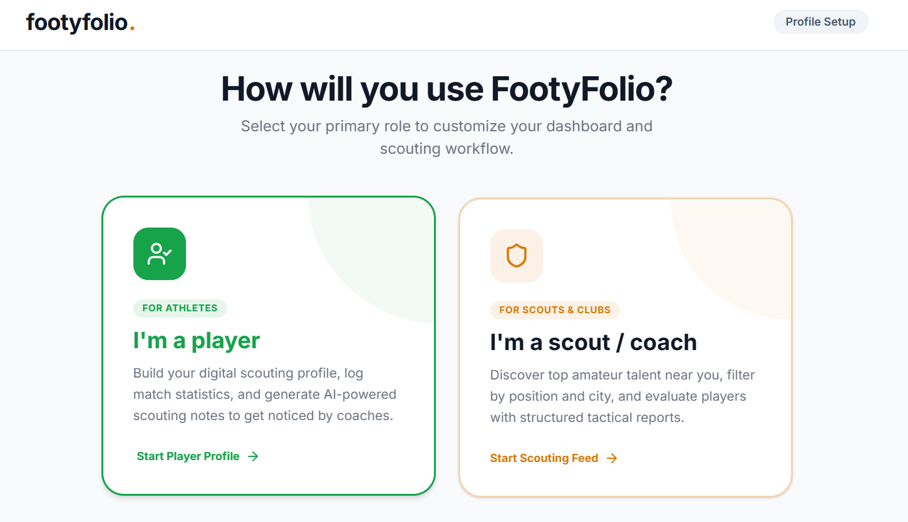
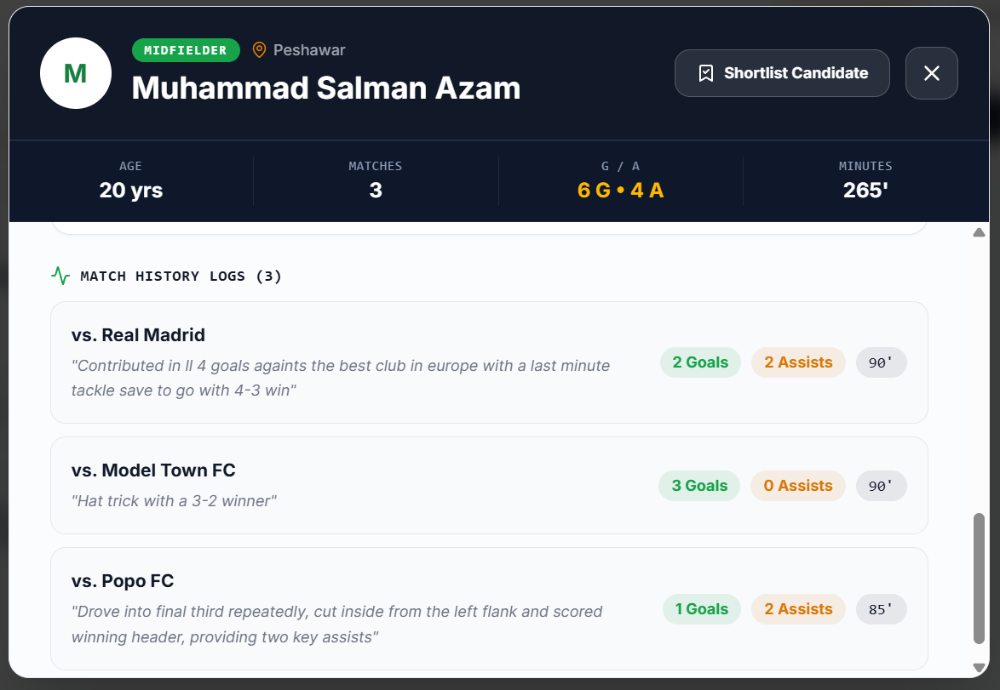
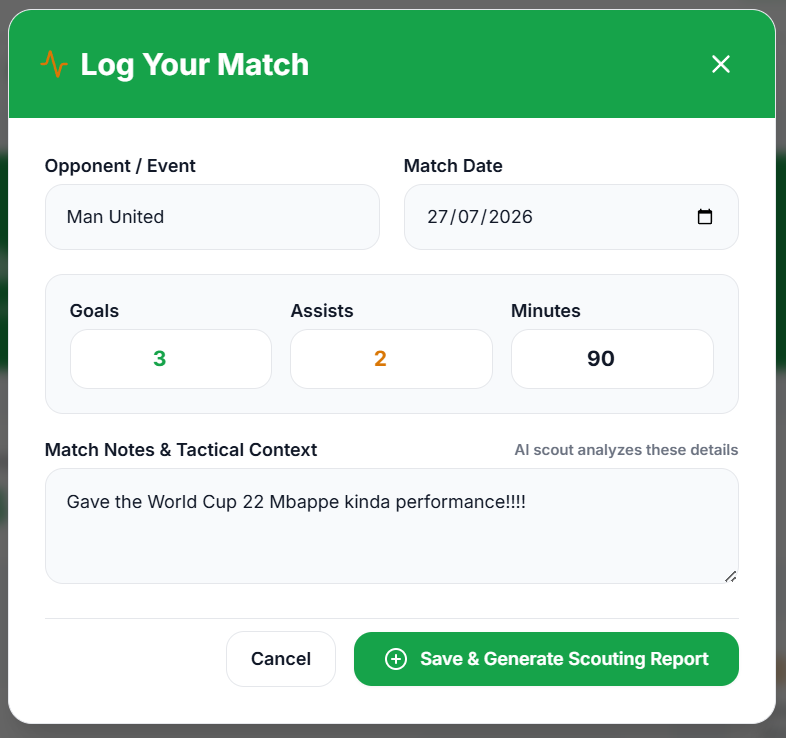
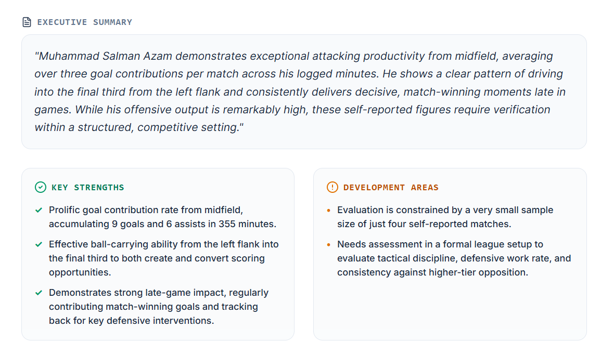
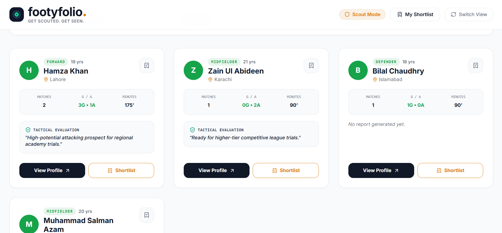

<div align="center">

# 🏟️ FootyFolio

### *The digital scouting dossier for grassroots football.*

**Turn a match performance into a professional scouting report, in one tap.**

[](https://footyfolio.vercel.app)
[](./LICENSE)
[](https://nextjs.org)
[](https://www.typescriptlang.org)
[](https://ai.google.dev)
[](https://supabase.com)
[](https://vercel.com)

</div>

<br>

> **The problem:** thousands of talented amateur footballers across Pakistan play every week in local leagues and street tournaments, and stay completely invisible to the scouts who could change their career. Scouting stays word-of-mouth, unstructured, and limited to whoever happens to be watching that day.
>
> **FootyFolio fixes the visibility problem.** Players log their match stats. AI turns that data into a scouting report a real academy would take seriously. Scouts get a live, filterable feed of local talent instead of relying on luck.

---

## 🌐 Try It Right Now

<div align="center">

### **[→ footyfolio.vercel.app ←](https://footyfolio.vercel.app)**

*Live. Deployed. Fully functional. Sign up as a Player or a Scout and see it work end to end.*

</div>

---

## 🧭 Who It's For

**Players** — amateur and grassroots footballers who play regularly (local leagues, street tournaments, five-a-side, college teams) but have no formal way to prove their performance to anyone outside the pitch.

**Scouts & coaches** — academy scouts, local club coaches, and anyone trying to find talent outside the small pool of players who happen to already be visible. Instead of relying on word-of-mouth, they get a searchable, filterable feed of real, self-reported performance data.

---

## ✨ What It Does

| | |
|---|---|
| 🎽 **Dual-role onboarding** | A tailored first-run flow for Players *and* Scouts — not the same generic signup form |
| 📊 **Match performance tracker** | Log goals, assists, minutes, and tactical notes after every match |
| 🤖 **AI scouting dossier** | Gemini turns raw stats into an executive summary, strengths, development areas, and a scout's verdict — structured like a real report, not a chatbot reply |
| 🔍 **Scout discovery feed** | Browse and filter local talent by position, city, and age |
| ⭐ **Shortlisting** | Scouts build and revisit a personal shortlist of prospects worth following up on |
| 🔐 **Real authentication** | Supabase email/password + Google OAuth — persistent sessions, not a demo toggle |
| 👤 **Guest mode** | Try the full flow with zero signup — data saves locally and syncs to a real account whenever you're ready |
| 📱 **Mobile-first** | Built for the phone-first way players and scouts actually use it on the ground |

---

## 🖼️ See It In Action

<table>
<tr>
<td width="50%">

**Choose your side of the game**
<br>


</td>
<td width="50%">

**A player's full track record**
<br>


</td>
</tr>
<tr>
<td width="50%">

**Logging a match takes seconds**
<br>


</td>
<td width="50%">

**The AI dossier, moments later**
<br>


</td>
</tr>
<tr>
<td colspan="2">

**A scout's view — real talent, filterable, at a glance**
<br>


</td>
</tr>
</table>

---

## 🤖 The AI, Explained

This isn't "summarize this text" wrapped in a football theme. Every report is generated from a system prompt written specifically to sound like a scout, not an assistant — grounded only in what the player actually logged, with an explicit instruction never to invent stats or skills that aren't in the data.

**Flow:** player logs a match → data is sent server-side to `/api/generate-report` → **Gemini 3.6 Flash** returns a strict JSON object → the app renders it as a structured dossier (Summary / Strengths / Areas to Develop / Verdict).

<details>
<summary><strong>📄 View the exact system prompt</strong></summary>

```text
You are an experienced football scout writing an internal scouting note about an
amateur player, based on match stats and notes they've logged themselves.

Write a scouting report with exactly this structure in JSON:

1. "summary": A 2-3 sentence player summary in a professional scouting tone —
   confident, specific, not generic praise. Reference actual patterns in the data
   (e.g. high goal involvement relative to minutes played, consistency across
   matches, positioning) rather than restating raw numbers.

2. "strengths": 2-3 short bullet points, each grounded in something specific from
   the data or notes provided. Do not invent skills not supported by the input.

3. "areasToDevelop": 1-2 honest, constructive bullet points, based on gaps in the
   data (e.g. limited minutes, low involvement in certain match types) or
   reasonable inference from the position.

4. "verdict": A single sentence a scout might write in a report margin, e.g.
   "Worth a closer look at trial stage" or "Promising for age group, needs more
   competitive minutes."

Tone: professional, direct, concise scout notes.
Do not fabricate specific statistics that were not provided. Only reason from
what's given.
```

**Enforced JSON response schema:**

```json
{
  "type": "OBJECT",
  "properties": {
    "summary": { "type": "STRING" },
    "strengths": { "type": "ARRAY", "items": { "type": "STRING" } },
    "areasToDevelop": { "type": "ARRAY", "items": { "type": "STRING" } },
    "verdict": { "type": "STRING" }
  },
  "required": ["summary", "strengths", "areasToDevelop", "verdict"]
}
```

</details>

---

## 🛠️ Under the Hood

| Layer | Technology |
|---|---|
| **Framework** | Next.js 16 (App Router) · React 19 · TypeScript |
| **AI Engine** | Google Gemini 3.6 Flash (`@google/genai`) |
| **Database & Auth** | Supabase — Postgres, Row Level Security, `@supabase/ssr` |
| **Styling** | Tailwind CSS v4 · Lucide Icons · Motion |
| **Deployment** | Vercel — auto-deploys on every push to `main` |

---

## 🚀 Run It Yourself

**Prerequisites:** Node.js 20+, npm

```bash
# 1. Clone and install
git clone https://github.com/salmanazamdev/footyfolio
cd footyfolio
npm install

# 2. Configure environment variables — create a .env file:
NEXT_PUBLIC_SUPABASE_URL="https://your-supabase-project.supabase.co"
NEXT_PUBLIC_SUPABASE_ANON_KEY="your-supabase-anon-key"
GEMINI_API_KEY="your-gemini-api-key"

# 3. Run the dev server
npm run dev
```

Open **[http://localhost:3000](http://localhost:3000)**.

**Production build:**
```bash
npm run build
npm start
```

---

## 🗄️ Database Schema

Full migration script at [`schema.sql`](./schema.sql).

| Table | Purpose |
|---|---|
| `profiles` | User ID, role (`talent` / `scout`), name, age, city, onboarding status |
| `talent_details` | Position, preferred foot, bio |
| `matches` | Per-match stats: opponent, goals, assists, minutes, notes, date |
| `scouting_reports` | AI-generated dossiers linked to each player |
| `scout_preferences` | A scout's default search filters |
| `shortlists` | Saved prospects per scout |

Row Level Security is enforced on every table — players can only write their own data, scouts can browse talent but only manage their own shortlist.

---

## 🗺️ Roadmap

Ideas on the table for future work — not built yet, and open to contributors:

- Real-time messaging between scouts and players
- Video highlight clips / media uploads
- Coach or team endorsements
- Public, shareable player profile links (no login required to view)
- Email/push notifications
- Smarter scout-side talent recommendations beyond position/city filters

---

## 🤝 Contributing

FootyFolio is open source and open to contributors — bug fixes, design polish, or picking something off the roadmap above. See [CONTRIBUTING.md](./CONTRIBUTING.md) for how to get started.

---

<div align="center">

### Built solo, end to end — idea, design, code, and deployment.

**FootyFolio — because talent shouldn't need a lucky break to get noticed.**

[**Try the live app →**](https://footyfolio.vercel.app)

</div>